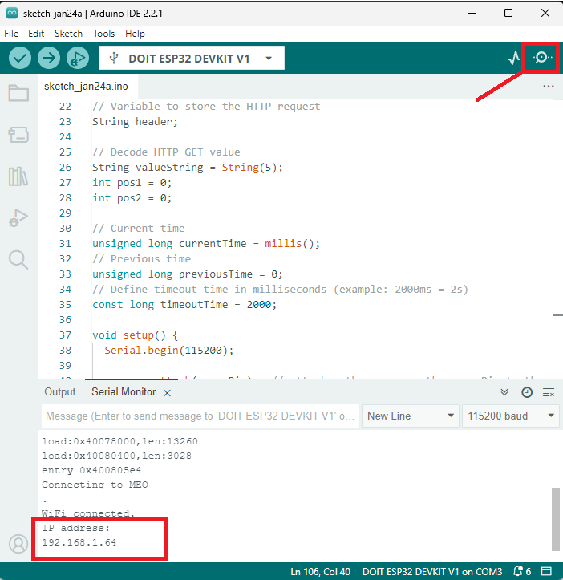
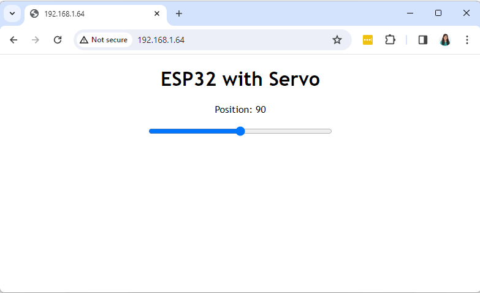

# Servo Motor Control with ESP32

This repository contains a project to control a servo motor using an ESP32. The main code includes features such as:  
- **Wi-Fi Connection**: Enables communication with a remote server.  
- **Command Scheduling**: Executes tasks based on preconfigured schedules.  
- **Time Synchronization via NTP**: Ensures precise timing.  
- **Servo Motor Control**: Opens and closes the servo to perform specific tasks.  

---

## 🚀 Features  
1. **Servo Control**: Automatically adjusts the servo angle to dispense food.  
2. **API Integration**: Receives and executes commands from a remote API.  
3. **Dynamic Scheduling**: Configures task execution based on time.
4. **User Account Management**: Integrates with a system that supports login, registration, and linking dispensers to user accounts.    

---

### 🧩 Dependencies  
This project relies on the following repositories:  
- [WebDispenserFrontend](https://github.com/victorrossh/WebDispenserFrontend):  
  A web interface for managing the system. It includes:  
  - **Token Display**: To link the dispenser to a user account.  
  - **Schedule Management**: Configure feeding times and monitor logs.  
  - **User System**: Login, registration, and user-dispenser linking.  
- [WebPetDispenserBackend](https://github.com/victorrossh/WebPetDispenserBackend):  
  Backend API for managing schedules, user data, and communication between the frontend and dispenser.

---

### Required Hardware  
- **ESP32**  
- **Servo Motor** (connected to GPIO 13)  
- **Power Supply**  
- **Wi-Fi Connection**  

---

### How to Set Up  

1. **Clone the Repository**:  
   ```bash
   git clone https://github.com/victorrossh/ESP32-Pet-Dispenser.git
   cd ESP32-Pet-Dispenser

2. **Wi-Fi Configuration**:
    ```bash
    const char* ssid = "YOUR_WIFI";
    const char* password = "YOUR_PASSWORD";

3. **Set Up API**:
Update the URL and token in the main code:
    ```bash
    const char deviceToken[] = "YOUR_TOKEN";

4. **Upload the Code**:
Use Arduino IDE or PlatformIO to compile and upload the code to the ESP32.

## Available Commands

- **OPEN_DEGREES**: Positions the servo at the configured angle to open.
- **CLOSE_DEGRESS**: Returns the servo to the closed position after execution.

---


## 🔧 Adjusting Servo Angle for Testing

To test and manually adjust the servo motor angles, you can use the `servo_tester.cpp` file included in this repository. This file sets up a web interface to control the servo angle in real time via a slider.

### How to Use `servo_tester.cpp`
1. Open the `servo_tester.cpp` file in your preferred IDE.

2. Configure your Wi-Fi credentials in the file:
   ```cpp
   const char* ssid = "YOUR_WIFI_SSID";
   const char* password = "YOUR_WIFI_PASSWORD";

3. Upload the code to your ESP32 using Arduino IDE or PlatformIO.  

4. Once uploaded, open the Serial Monitor to find the IP address of your ESP32. Use this IP address to access the web interface:  
     

5. Enter the IP address into your browser. You will see a simple web interface with a slider to control the servo angle:  
     

This tool allows you to adjust the servo's position easily and verify its functionality.

For more detailed instructions, you can refer to the full tutorial [here](https://randomnerdtutorials.com/esp32-servo-motor-web-server-arduino-ide/).

---

## 🔥 Acknowledgements

- The `main.cpp` file was developed by me, **Victor Ross**, for the servo motor control project.
- The `servo_tester.cpp` file was based on code from a tutorial by **Rui Santos** and **Sara Santos** at [Random Nerd Tutorials](https://randomnerdtutorials.com/esp32-servo-motor-web-server-arduino-ide/). It is used for testing and adjusting the servo angle through a web interface.

---
